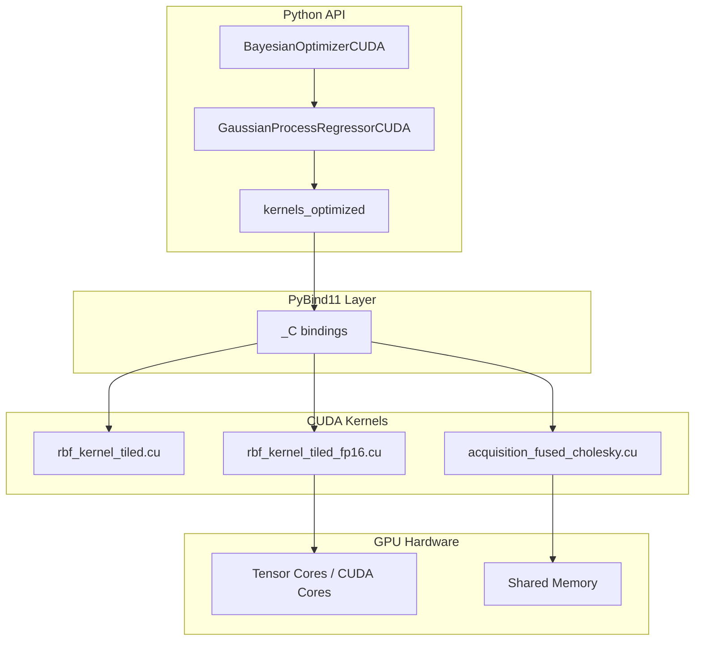

# BayesOpt-CUDA

[](https://developer.nvidia.com/cuda-toolkit)
[](https://www.python.org/)
[](https://pytorch.org/)
[](LICENSE)

GPU-accelerated Bayesian Optimization with custom CUDA kernels for Gaussian Process regression and acquisition function evaluation. BayesOpt-CUDA combines high-level Python APIs with low-level CUDA implementations to accelerate covariance matrix construction and Bayesian optimization workloads while maintaining compatibility with common machine learning workflows.

---

## Overview

BayesOpt-CUDA provides optimized implementations of the computational bottlenecks encountered in Gaussian Process (GP) regression and Bayesian Optimization (BO). The library integrates custom CUDA kernels, PyBind11 bindings, and PyTorch tensor operations to deliver efficient GPU execution while exposing a familiar Python interface.

The project is designed for:

* Bayesian Optimization of expensive black-box functions
* Hyperparameter optimization
* Surrogate modeling using Gaussian Processes
* GPU-accelerated acquisition function evaluation
* Research and experimentation with custom GP kernels

---

## Features

### Optimized RBF Covariance Kernels

* Custom CUDA implementation of the Gaussian Radial Basis Function (RBF) kernel
* 16 × 16 shared-memory tiled execution strategy
* Reduced global memory traffic through data reuse
* Up to **3.26× faster** than baseline PyTorch implementations on benchmark workloads

### Mixed-Precision Execution

* Native CUDA `__half2` vectorized arithmetic
* Reduced memory bandwidth requirements through FP16 storage
* FP32 accumulation and exponentiation for numerical stability
* Up to **2.21× speedup** at intermediate problem sizes

### Fused Acquisition Function Evaluation

Single-pass CUDA kernels for:

* Expected Improvement (EI)
* Upper Confidence Bound (UCB)
* Probability of Improvement (PI)

These kernels fuse posterior prediction and acquisition computation, eliminating intermediate covariance matrix materialization and reducing memory overhead.

### Cholesky-Based Variance Computation

* Predictive variance computed directly from the Cholesky factorization
* Parallel forward-substitution performed within CUDA kernels
* O(n) shared-memory footprint
* Scales efficiently to larger training sets without excessive memory usage

---

## Architecture

BayesOpt-CUDA bridges Python APIs and custom CUDA kernels through PyBind11 bindings.

* Python provides the user-facing GP and Bayesian Optimization interfaces.
* PyBind11 handles tensor dispatch and kernel invocation.
* CUDA kernels perform covariance computation and acquisition evaluation.
* PyTorch supplies tensor management and GPU-based linear algebra operations.

The covariance matrix factorization

[
K_{train} = LL^T
]

is computed using PyTorch's optimized linear algebra backend, while distance calculations and acquisition evaluations are executed using custom CUDA kernels.



---

## Documentation

Additional documentation is available in the `docs/` directory:

| Document          | Description                                            |
| ----------------- | ------------------------------------------------------ |
| `architecture.md` | System architecture, execution flow, and data movement |
| `api.md`          | Python and C++ API reference                           |
| `kernels.md`      | Mathematical formulations and kernel implementations   |
| `benchmarks.md`   | Benchmark methodology and performance analysis         |

---

## Installation

### Requirements

| Component        | Version   |
| ---------------- | --------- |
| Python           | 3.11+     |
| PyTorch          | 2.0+      |
| CUDA Toolkit     | 12.1+     |
| Windows Compiler | MSVC 2022 |
| Linux Compiler   | GCC 9+    |

Supported platforms:

* Windows 10 / 11
* Linux (x86_64)

---

### Build from Source

Clone the repository:

```bash
git clone https://github.com/example/bayesopt_cuda.git
cd bayesopt_cuda
```

Install in editable mode:

```bash
pip install -e .
```

#### Windows

If Visual Studio build tools are not initialized in your shell:

```bash
build.bat
```

The script automatically configures the MSVC environment and builds the extension modules.

---

### Docker

A Dockerfile is provided for reproducible builds.

Build the image:

```bash
docker build -t bayesopt-cuda .
```

Run with GPU access:

```bash
docker run --gpus all -it bayesopt-cuda
```

---

## Quick Start

### Gaussian Process Regression

```python
import numpy as np
from bayesopt_cuda.gp_cuda import GaussianProcessRegressorCUDA

X_train = np.random.uniform(-3.0, 3.0, size=(100, 2)).astype(np.float32)
y_train = np.sin(X_train[:, 0]) * np.cos(X_train[:, 1])

gp = GaussianProcessRegressorCUDA(
    lengthscale=1.0,
    variance=1.0,
    noise=1e-5,
    device="cuda"
)

gp.fit(X_train, y_train)

X_test = np.random.uniform(-3.0, 3.0, size=(1000, 2)).astype(np.float32)

mean, std = gp.predict(
    X_test,
    return_std=True
)

print(mean.shape, std.shape)
```

---

### Bayesian Optimization

```python
import numpy as np
from bayesopt_cuda.optimizer_cuda import BayesianOptimizerCUDA
from bayesopt_cuda.reference import branin

def objective(x):
    return float(-branin(x))

bounds = np.array([
    [-5.0, 10.0],
    [0.0, 15.0]
], dtype=np.float32)

optimizer = BayesianOptimizerCUDA(
    objective=objective,
    bounds=bounds,
    acquisition="ei",
    n_candidates=5000,
    n_local_restarts=10,
    device="cuda"
)

X_history, y_history = optimizer.run(
    n_iter=20
)

print("Best parameters:", optimizer.best_x)
print("Best objective:", optimizer.best_y)
```

---

### Demo

Run a synthetic benchmark to validate installation and measure performance:

```bash
python demo.py --n 1024 --m 4096 --d 16
```

---

## Performance

Benchmarks were collected on an NVIDIA GeForce RTX 5080 Laptop GPU (Blackwell architecture) using CUDA 13.3 and PyTorch 2.6.

### RBF Kernel Performance

| Problem Size (n, m, d) | PyTorch (ms) | Tiled FP32 (ms) | Tiled FP16 (ms) | FP32 Speedup | FP16 Speedup |
| ---------------------- | ------------ | --------------- | --------------- | ------------ | ------------ |
| (512, 512, 8)          | 0.057        | 0.023           | 0.021           | 2.53×        | 2.73×        |
| (1024, 1024, 16)       | 0.084        | 0.054           | 0.038           | 1.53×        | 2.21×        |
| (2048, 2048, 32)       | 0.939        | 0.288           | 0.311           | 3.26×        | 3.02×        |

### Expected Improvement Evaluation

| Problem Size (n, m, d) | PyTorch (ms) | Fused Inverse (ms) | Fused Cholesky (ms) |
| ---------------------- | ------------ | ------------------ | ------------------- |
| (32, 256, 2)           | 0.148        | 0.031              | 0.036               |
| (64, 512, 4)           | 0.115        | 0.042              | 0.060               |

### Notes

* Custom kernels provide substantial gains for small and medium-sized Bayesian Optimization workloads.
* At larger matrix dimensions, highly optimized vendor libraries such as cuBLAS may outperform custom implementations due to Tensor Core acceleration.
* Performance characteristics depend on GPU architecture, problem size, and precision mode.

---

## Testing

Install test dependencies:

```bash
pip install pytest
```

Run the full test suite:

```bash
python -m pytest tests/ -v
```

The tests validate numerical correctness against reference implementations from SciPy and PyTorch.

---

## Roadmap

Planned improvements include:

* Additional covariance kernels (Matern, Rational Quadratic)
* Batched multi-GPU evaluation
* Automatic mixed-precision support
* BoTorch model interoperability
* Multi-objective Bayesian Optimization
* Sparse Gaussian Process approximations

---

## License

Distributed under the MIT License.

See the `LICENSE` file for complete license terms.
